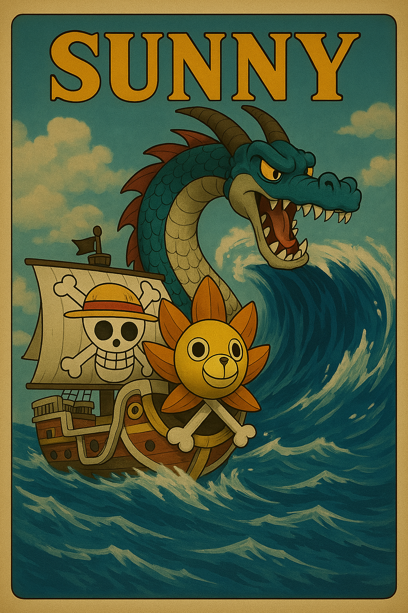

# 🌞 Sunny

**Sunny** is a retro-inspired 2D runner game made with HTML, CSS, and JavaScript.  
It's a personal experiment — my first full game project — blending pixel art, Game Boy aesthetics, and basic game mechanics into a playful learning experience.

> 🎮 **Play now:** [Click here to play Sunny on GitHub Pages](https://fschaitel.github.io/Sunny/)  

---

## 🎯 Objectives

- Build a complete web-based game from scratch
- Explore game loops, animation, and canvas rendering
- Use pixel art for visual design
- Handle collision detection and user input
- Add audio and simple UI flow

---

## 🛠️ Built With

- **HTML5** – structure and canvas
- **CSS3** – layout, start screen, and styling
- **JavaScript (Vanilla)** – game loop, logic, events
- **Pixel Art** – custom retro-style sprites
- **MP3 Audio** – looping background music (chiptune)


---

## 🧠 How It Works

- The game starts with a **black & white intro screen** and a **START button**
- Upon clicking START:
  - An **intro video** plays
  - The background music begins to play in a loop
  - The player controls the ship "Sunny" using the arrow keys
- **↑ / ↓** move the ship vertically (but it can't go into the sky!)
- **← / →** move the ship horizontally across the screen
- **Waves** appear as obstacles from the right in randomized positions and sizes
- Colliding with a wave or cannonball causes damage. Lose all lives = **GAME OVER**
- Reach 10.000 points to face the **Navy Boss**
- Defeat the boss to reach the **Victory Screen**

---

## ▶️ How to Play

- Press `START`
- Watch the intro video
- Use `↑ ↓ ← →` arrow keys to steer the ship
- Avoid waves, Sea Kings, and cannonballs!
- Grab life items (max 3 lives)
- Survive and reach 10.000 points to fight the boss

---

## 🧪 Educational Highlights

This project covers core game development concepts:

- Game loop using `requestAnimationFrame`
- 2D canvas rendering
- Basic physics and movement
- Random obstacle generation
- Collision detection with hitbox padding
- UI flow (start → intro → play → boss → game over / victory)
- Audio and video integration

---

## 🔹 Version History

### 🔎 v1.7.0 – Navy Boss, Victory Ending & Easter Egg (2025-04-02)
- 🚢 Navy Boss appears at **10.000 points**, shoots cannonballs
- 🏴‍☠️ Victory screen after defeating the boss
- ❓ Mystery image appears at 6100 points with shake effect
- 💙 Garp & Luffy dialog between 7000-8000 points

#### Balance & Tweaks
- Obstacle frequency scales with score (100 → 80 → 60)
- Life item appears every 8000 points (was 10000)
- Max lives capped at 3 (was 5)

### 🔎 v1.5.1 – Progressive Obstacle Spawn & Life Item Tweaks (2025-04-01)
- Obstacle spawn rate now scales with score
- Life item frequency reduced; max lives capped at 3

### 🔎 v1.4.1 – Enhanced 8-bit UI (2025-03-30)
- Redesigned START & GAME OVER screens with pixel backgrounds
- Pixel font and arcade color schemes for buttons

### 🔎 v1.4.0 – Intro Video & Music Sync (2025-03-30)
- Added video intro synced with background music
- Game starts only after video ends

### 🔎 v1.3.0 – Sea King, Diagonal Movement & Speed Boost (2025-03-30)
- Sea King appears every 1500 points
- Diagonal movement and speed scaling added
- Refactored input system and collision logic

### 🔎 v1.1 – Retro Aesthetic & Game Over Screen (2025-03-29)
- Game Boy style visuals
- Restart without refresh
- Smooth parallax background

---

## 📁 Project Structure

```
SunnySails/
├── index.html
├── style.css
├── script.js
├── README.md
└── assets/
    ├── ocean-bg-light.png
    ├── sunny-8bit.png
    ├── wave.png
    ├── gb-music.mp3
    ├── sea-king.png
    ├── navy-boss.png
    ├── cannonball.png
    ├── crew.png
    ├── luffy-banner.png
    ├── garp-banner.png
    ├── akuma-nomi.png
    ├── straw-hat.png
    ├── berry.png
    └── intro-video.mp4
```

---

## 🚀 Run Locally

```bash
git clone https://github.com/your-username/Sunny.git
cd Sunny
# Use Live Server (VS Code extension) or any local HTTP server
```

> 💡 Don't open with `file://`. Use Live Server to avoid audio/image loading issues.

---

## 🌐 Host Online (GitHub Pages)

1. Push this project to a public GitHub repository
2. Go to **Settings > Pages**
3. Set **Source: main / root**
4. After publishing, your game will be live at:
```
https://your-username.github.io/SunnySails/
```
---

## 📚 Tutorial

Want to learn how this game was built step-by-step?  
Check the full dev tutorial here:  
👉 [Sunny – Full Game Development Tutorial](.docs/tutorial.md)

---

## 📜 License

This project is open for learning and fun.  
You may reuse the code freely. Please credit or replace visuals/audio if you plan to publish it elsewhere.

---

## 🙏 Credits

- Font: [Press Start 2P](https://fonts.google.com/specimen/Press+Start+2P)
- One Piece inspiration: characters and aesthetics © Eiichiro Oda
- All images and sounds are custom or adapted for non-commercial use

---

## 👨‍💻 Author

Created with curiosity and pixel love  
by **Felipe Schaitel**  
🗓️ 2025-04-04

